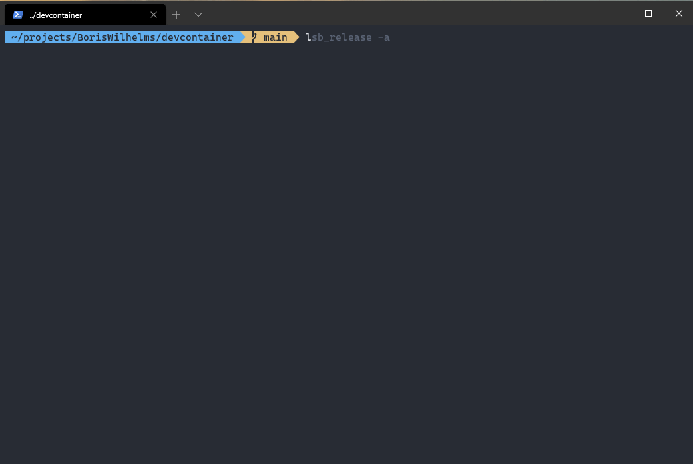

# Run devcontainer outside of Visual Studio Code
Are you also a big fan of [Visual Studio Devcontainer](https://code.visualstudio.com/docs/remote/containers)? Do you also sometimes want to just run the devcontainer outside of Visual Studio Code? Me also! That is why I have created this simple bash script. The script parses the `devcontainer.json` file and runs the docker container outside of Visual Studio Code.

Example



## How does it work?
The script can be run in any workspace the contains the `.devcontainer` configuration folder. On start, it parses several different options from the `devcontainer.json` file, builds the dockerfile, and starts the container. The script mounts the current folder into the container into the `/workspaces/$currentfolder` path. Same as Visual Studio Code does. 

The following options from the `devcontainer.json` are supported:

- `dockerFile` uses the defined dockerfile.
- `settings["terminal.integrated.shell.linux"]` uses the defined shell.
- `forwardPorts` published the defined ports to the host.
- `remoteEnv` uses the defined environment variables.
- `remoteUser` starts the shell with the defined user.

## How to install?
You can install the devcontainer script by either [downloading the script](https://raw.githubusercontent.com/BorisWilhelms/devcontainer/main/devcontainer.sh) and place it into a folder in you $PATH variable or you can use the following command to download and install the script.

```
sudo sh -c 'curl -s https://raw.githubusercontent.com/BorisWilhelms/devcontainer/main/devcontainer.sh > /usr/local/bin/devcontainer && chmod +x /usr/local/bin/devcontainer'
```
## Prerequisites
The script uses [jq](https://stedolan.github.io/jq/) to parse the `devcontainer.json`. Therefore it must be installed.
Also GNU sed need to be installed


## Known issues
- Since `jq` expects a valid JSON file, all possible JSON error (e.g. `,` without following properties) has to be corrected. The script will strip all comments (`//`) to make it more valid.


## Development

### Run shellcheck
`git ls-files | grep '.sh' | xargs shellcheck`